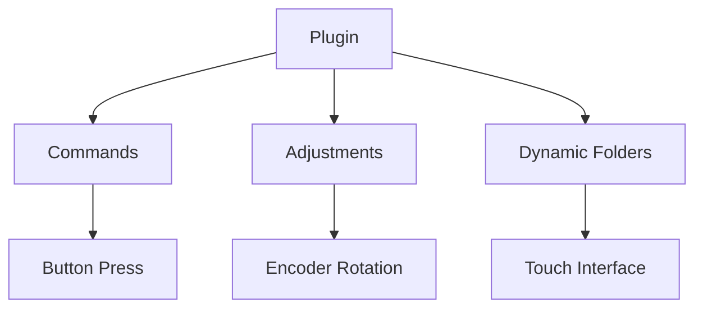
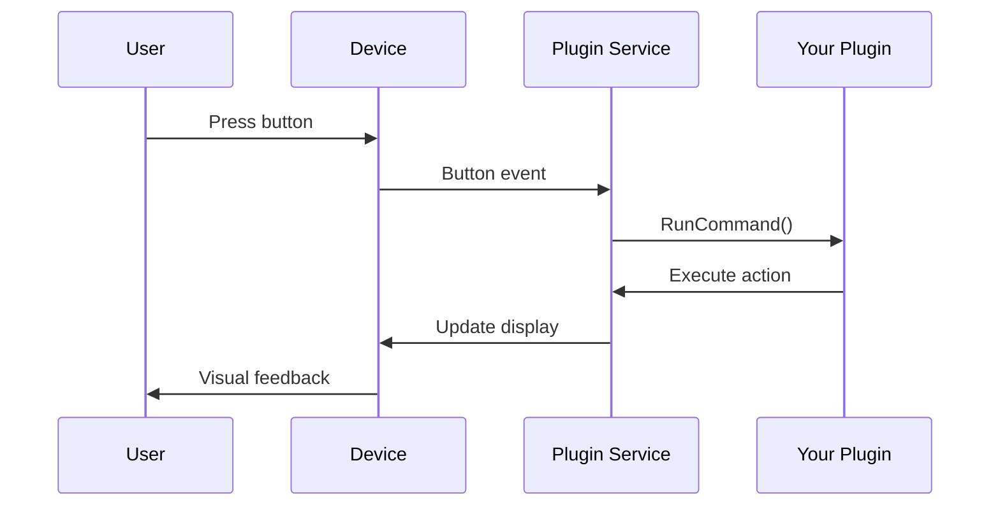

# Core Objects

Understanding the fundamental objects and concepts in the Logi Actions SDK is essential for building effective plugins.

## Plugin Architecture

The Logi Actions SDK follows a hierarchical structure where plugins contain actions, and actions respond to device interactions.



## Core Classes

### Plugin

The main plugin class that serves as the entry point for your plugin.

```csharp
public class MyPlugin : Plugin
{
    public override void Load()
    {
        // Initialize plugin
        this.Info.DisplayName = "My Plugin";
        this.Info.Description = "Plugin description";
    }

    public override void Unload()
    {
        // Cleanup resources
    }
}
```

**Key Properties:**
- `Info.DisplayName`: Name shown in UI
- `Info.Description`: Plugin description
- `Assembly`: Plugin assembly reference

### PluginDynamicCommand

Represents a button or action that users can assign to device controls.

```csharp
public class MyCommand : PluginDynamicCommand
{
    public MyCommand() : base(
        displayName: "My Action",
        description: "What this action does",
        groupName: "My Group")
    {
    }

    protected override void RunCommand(string actionParameter)
    {
        // Execute when button is pressed
    }
}
```

**Key Methods:**
- `RunCommand()`: Executed on button press
- `GetCommandDisplayName()`: Dynamic button text
- `GetCommandImage()`: Custom button image

### PluginDynamicAdjustment

Handles encoder rotations and continuous value changes.

```csharp
public class VolumeAdjustment : PluginDynamicAdjustment
{
    public VolumeAdjustment() : base(
        displayName: "Volume",
        description: "Adjust system volume",
        groupName: "Audio",
        hasReset: true)
    {
    }

    protected override void ApplyAdjustment(string actionParameter, int diff)
    {
        // Handle encoder rotation
        var currentVolume = GetSystemVolume();
        SetSystemVolume(currentVolume + diff);
    }

    protected override void RunCommand(string actionParameter)
    {
        // Handle encoder press (reset)
        SetSystemVolume(50); // Reset to 50%
    }
}
```

### ClientApplication

Links your plugin to specific applications for context-aware behavior.

```csharp
public class PhotoshopApplication : ClientApplication
{
    protected override string GetProcessName() => "Photoshop";

    protected override string GetBundleId() => "com.adobe.Photoshop";
}
```

## Object Lifecycle

### Plugin Lifecycle

1. **Load**: Plugin is initialized
2. **Commands Registered**: Actions become available
3. **Active**: Plugin responds to device interactions
4. **Unload**: Plugin is shut down

```csharp
public override void Load()
{
    // Subscribe to events
    this.OnApplicationStarted += OnAppStarted;
    this.OnApplicationStopped += OnAppStopped;
}

public override void Unload()
{
    // Unsubscribe from events
    this.OnApplicationStarted -= OnAppStarted;
    this.OnApplicationStopped -= OnAppStopped;
}
```

### Command Lifecycle

1. **Construction**: Command object created
2. **Registration**: Added to plugin registry
3. **Assignment**: User assigns to device control
4. **Execution**: `RunCommand()` called on interaction
5. **Cleanup**: Command disposed when plugin unloads

## Data Flow

### User Interaction Flow



### State Management

```csharp
public class StatefulCommand : PluginDynamicCommand
{
    private bool _isEnabled = false;

    protected override void RunCommand(string actionParameter)
    {
        _isEnabled = !_isEnabled;
        
        // Notify service of state change
        this.ActionImageChanged(actionParameter);
    }

    protected override string GetCommandDisplayName(string actionParameter, PluginImageSize imageSize)
    {
        return _isEnabled ? "Enabled" : "Disabled";
    }
}
```

## Parameters and Context

### Action Parameters

Commands can accept parameters for dynamic behavior:

```csharp
public class ParameterizedCommand : PluginDynamicCommand
{
    public ParameterizedCommand() : base()
    {
        // Add parameters in constructor
        this.AddParameter("param1", "First Option", "Options");
        this.AddParameter("param2", "Second Option", "Options");
    }

    protected override void RunCommand(string actionParameter)
    {
        switch (actionParameter)
        {
            case "param1":
                // Handle first option
                break;
            case "param2":
                // Handle second option
                break;
        }
    }
}
```

### Context Information

Access device and application context:

```csharp
protected override void RunCommand(string actionParameter)
{
    // Get current application
    var currentApp = this.Plugin.ClientApplication;
    
    // Check device capabilities
    var deviceInfo = this.Plugin.GetDeviceInfo();
    
    // Access plugin settings
    if (this.Plugin.TryGetPluginSetting("setting_key", out string value))
    {
        // Use setting value
    }
}
```

## Best Practices

### ✅ Do

- Keep command logic lightweight and responsive
- Use meaningful display names and descriptions
- Handle errors gracefully with try-catch blocks
- Implement proper cleanup in `Unload()`
- Use parameters for similar but distinct actions

### ❌ Don't

- Perform long-running operations in `RunCommand()`
- Block the UI thread with synchronous operations
- Ignore exceptions or fail silently
- Create too many similar commands (use parameters instead)
- Store sensitive data in plain text

## Performance Considerations

### Efficient Command Execution

```csharp
protected override void RunCommand(string actionParameter)
{
    // Use async operations for I/O
    Task.Run(async () =>
    {
        try
        {
            await PerformLongRunningOperation();
        }
        catch (Exception ex)
        {
            // Log error, don't crash plugin
            this.Plugin.Log.Error(ex, "Command execution failed");
        }
    });
}
```

### Memory Management

```csharp
public class ResourceAwareCommand : PluginDynamicCommand, IDisposable
{
    private readonly HttpClient _httpClient = new HttpClient();

    public void Dispose()
    {
        _httpClient?.Dispose();
    }
}
```

## Next Steps

- **Learn about device interactions**: [Webhooks](./webhooks.md)
- **Understand performance limits**: [Rate Limits](./rate-limits.md)
- **See practical examples**: [Guides & Tutorials](../guides/payment-intents.md)

---

*Understanding these core objects is fundamental to building effective plugins.*