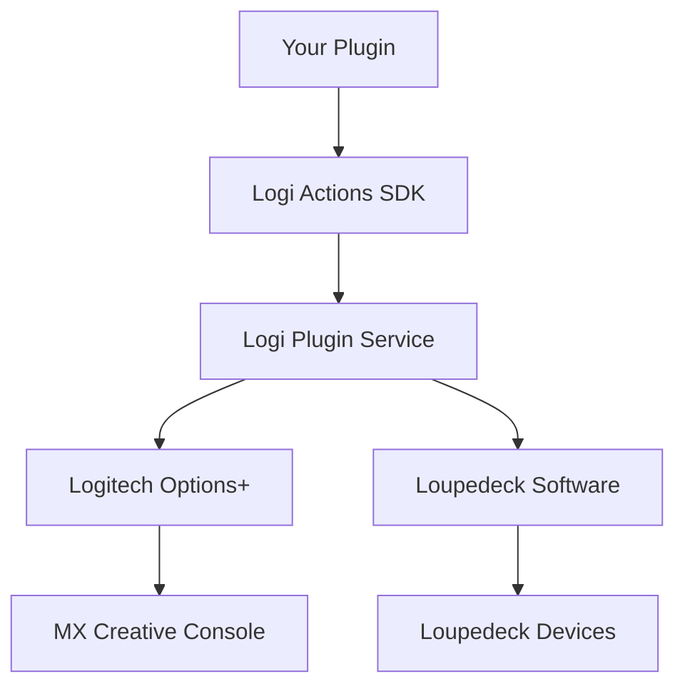

# Logi Actions SDK Overview

The Logi Actions SDK empowers developers to create custom plugins that enhance the functionality of Logitech MX Creative Console and Loupedeck devices. Build powerful integrations, automate creative workflows, and unlock new possibilities for professional and creative environments.

## What You Can Build

- **Creative Workflow Automation**: Streamline repetitive tasks in design and video editing applications
- **Hardware Control**: Integrate with external devices, lighting systems, and IoT platforms  
- **API Integrations**: Connect to cloud services, databases, and third-party applications
- **Custom Controls**: Create specialized interfaces for niche professional tools

## Architecture Overview

## Supported Platforms

| Platform | Language | Runtime |
|----------|----------|---------|
| Windows | C# | .NET 8.0+ |
| macOS | C# | .NET 8.0+ |

## Supported Devices

- Logitech MX Creative Console
- Loupedeck CT
- Loupedeck Live
- Loupedeck Live S
- Razer Stream Controller
- Razer Stream Controller X

## Key Features

- **Hot Reload Development**: Instant plugin updates during development
- **Rich UI Components**: Buttons, encoders, touch screens, and custom graphics
- **Event System**: Respond to device interactions and application state changes
- **Settings Management**: Persistent configuration and user preferences
- **Marketplace Distribution**: Reach users through official app stores

## Quick Links

- [GitHub Repository](https://github.com/logitech/actions-sdk) 
- [Community Forum](https://community.logitech.com/developers)
- [Sample Projects](./samples.md)
- [Release Notes](./release-notes.md)

## Next Steps

1. **New to the SDK?** Start with [Getting Started](./getting-started.md)
2. **Ready to code?** Jump to [Quick Start](./quick-start.md)
3. **Need reference docs?** Check the [API Reference](./api-reference.md)

---

*Estimated reading time: 2 minutes*